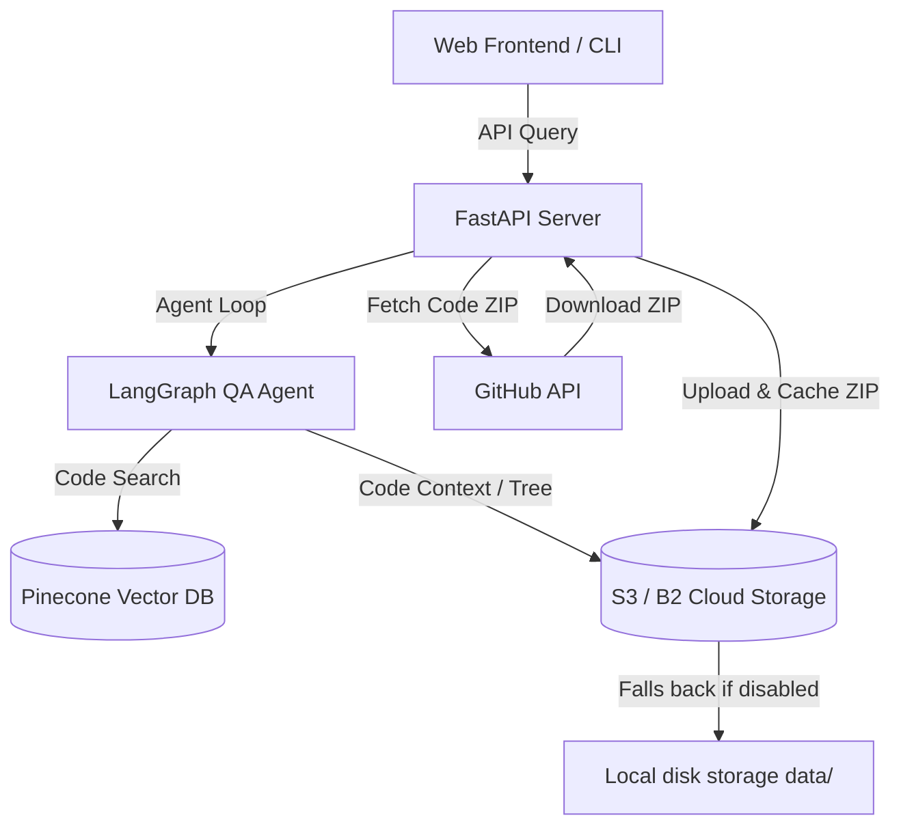

# 🤖 GitHub Repository QA Bot (Stateless RAG Backend)

An advanced, production-ready, stateless Retrieval-Augmented Generation (RAG) backend that allows you to index any GitHub repository, perform static dependency-graph analysis, and answer user queries with full code intelligence. 

Built using **FastAPI**, **LangGraph**, **Gemini / OpenRouter**, **Pinecone**, and **Backblaze B2 / S3 Object Storage**.

---

## 🌟 Key Features

*   **Stateless Architecture:** No persistent local disk volumes required. Ideal for deployment on serverless platforms (Fly.io, Render Free Tier, etc.).
*   **S3-Compatible Cloud Caching:** Caches repository archives, file tree index SHAs, and dependency graphs in S3-compatible object storage (e.g., card-free Backblaze B2 or Cloudflare R2).
*   **Static Code Analysis:** Builds a dependency graph of files to track structures, classes, functions, and imports for smarter context retrieval.
*   **Intelligent LangGraph Agent:** Uses structured tool-use to search code files, trace import dependencies, and retrieve relevant chunks before answering.
*   **Auto-Fallback Storage:** Automatically falls back to local disk storage (`data/`) if S3 credentials are not specified, keeping local development zero-config.

---

## 🏗️ Architecture Overview



---

## 🛠️ How It Is Built (Technical Implementation)

The bot is designed to understand codebases structurally rather than just treating them as flat text documents. Here is the technical breakdown of how the RAG pipeline is built:

### 1. Stateless Code Ingestion & Caching
* **ZIP Streaming:** Instead of extracting files to disk, the backend streams the repository zip archive directly from GitHub.
* **S3 Storage Engine:** Once downloaded, the ZIP file is stored in Backblaze B2/Cloudflare R2 as a binary blob.
* **In-Memory Reading:** Subsequent code reads and file structure requests fetch the ZIP into an in-memory buffer (`io.BytesIO`) and query it via Python's `zipfile` module.

### 2. Multi-Language Syntax-Tree Chunking
Rather than using generic character/word splits that break functions or classes in half, the indexing pipeline parses code nodes:
* **Python AST Chunker:** Uses Python's native `ast` library to identify classes, method bodies, and functions, separating them cleanly.
* **Tree-Sitter Language Parser:** For other supported languages (JS, TS, TSX, Java, Go, Rust, C/C++), the app utilizes `tree-sitter` (via `tree-sitter-language-pack`) to read nodes like `class_declaration`, `method_definition`, and `lexical_declaration` to produce clean code chunks.
* **Token Fallback:** Falls back to a token-based `tiktoken` chunker for markdown files and text assets.

### 3. Static Dependency Graph Construction
To help the agent understand how code flows across files, the system builds a static code graph:
* **Abstract Import Mapping:** Extracts import paths and tracks references using language-specific syntax matching rules.
* **Graph Tools:** Computes relationships to expose tools like:
  * `find_imports`: Check what files a file imports.
  * `find_usages`: Search where a particular symbol/function is referenced in the project.
  * `trace_call_chain`: Trace function execution flows recursively.

### 4. LangGraph ReAct Agent Loop
The query interface uses a stateful agent loop:
* **Tool Bindings:** Binds standard text RAG search (`search_tool`), directory list (`list_repo_files_tool`), and graph analysis tools to the LLM.
* **Persistent Memory Checkpointing:** Uses a Postgres-backed checkpoint database (`PostgresSaver`) to save user chat histories, with a memory-backed saver fallback for local development.

---

## ⚙️ Configuration & Environment Variables

Create a `.env` file in the root directory. Here are the environment variables supported:

### 1. Core API Keys
| Variable | Description | Required |
| :--- | :--- | :--- |
| `GITHUB_TOKEN_KEY` | Personal Access Token (PAT) for GitHub API. | **Yes** |
| `GEMINI_API_KEY` | Google Gemini API Key for code understanding and agent reasoning. | **Yes** |
| `OPENROUTER_API_KEY` | OpenRouter API key for loading alternative LLM models. | **Yes** |
| `PINECONE_API_KEY` | Pinecone API key for vector storage. | **Yes** |
| `PINECONE_INDEX_NAME`| Name of your Pinecone index. | **Yes** |
| `DATABASE_URL` | PostgreSQL Database connection string for storing user accounts. | **Yes** |

### 2. S3-Compatible Storage Settings (Backblaze B2 / Cloudflare R2)
Specify these variables to enable stateless cloud caching. If omitted, the app falls back to local storage.

| Variable | Description |
| :--- | :--- |
| `S3_ENDPOINT_URL` | The endpoint URL of your S3 bucket (e.g. `https://<account-id>.<region>.backblazeb2.com`). |
| `R2_ACCESS_KEY_ID` | Your S3 Access Key ID (or keyID for Backblaze). |
| `R2_SECRET_ACCESS_KEY`| Your S3 Secret Access Key (or applicationKey for Backblaze). |
| `R2_BUCKET_NAME` | The bucket name in your S3 storage space. |

### 3. Server Settings
| Variable | Description |
| :--- | :--- |
| `ENVIRONMENT` | Run environment (`development` or `production`). |
| `JWT_SECRET_KEY` | JWT signature key (required in `production` mode). |
| `ALLOWED_ORIGINS` | CORS origins list (comma-separated, e.g. `https://myfrontend.com`). |

---

## 🛠️ Step-by-Step Setup

### Prerequisites
Make sure you have **[uv](https://github.com/astral-sh/uv)** installed. It is a fast Python package installer and resolver.

```bash
# Check if uv is installed
uv --version
```

### 1. Initialize and Sync Virtual Environment
Initialize the `.venv` and install all project dependencies from `pyproject.toml` and `requirements.txt`:

```bash
uv sync
```

### 2. Run the Server Locally
To spin up the FastAPI backend locally:

```bash
uv run uvicorn main:app --reload --port 8000
```
The documentation will be available at `http://127.0.0.1:8000/docs`.

---

## ☁️ Setting Up Cloud Caching

### Option A: Backblaze B2 (Recommended - Credit Card Free! 🌟)
1. **Sign Up:** Go to [Backblaze B2 Cloud Storage](https://www.backblaze.com/b2/cloud-storage.html) and register (10 GB free tier).
2. **Create Bucket:** Go to **Buckets** ➡️ **Create a Bucket**. Set name (e.g. `github-qa-bot-storage`) and keep it private.
3. **Application Keys:** Go to **App Keys** ➡️ **Add a New Application Key**. Obtain `keyID` (Access Key ID) and `applicationKey` (Secret Access Key).
4. **Copy Endpoint:** Note down your bucket's endpoint URL listed under bucket details (e.g., `https://<account-id>.<region>.backblazeb2.com`).
5. Set the values in `.env`:
   ```env
   S3_ENDPOINT_URL=https://<account-id>.<region>.backblazeb2.com
   R2_ACCESS_KEY_ID=your-keyID
   R2_SECRET_ACCESS_KEY=your-applicationKey
   R2_BUCKET_NAME=github-qa-bot-storage
   ```

### Option B: Cloudflare R2
1. **Create Bucket:** Go to Cloudflare Dashboard ➡️ **R2** ➡️ **Create Bucket**.
2. **Create API Token:** Click **Manage R2 API Tokens** ➡️ **Create API Token** (Choose Edit permissions).
3. Set the values in `.env`:
   ```env
   R2_ACCOUNT_ID=your-cloudflare-account-id
   R2_ACCESS_KEY_ID=your-access-key-id
   R2_SECRET_ACCESS_KEY=your-secret-access-key
   R2_BUCKET_NAME=your-bucket-name
   ```

---

## 📂 Project Structure

```
├── api/                # FastAPI Routers (Auth & QA Routes)
├── cache/              # File caching logic (SHA validations)
├── graph/              # Dependency graph logic (Builder & Store)
├── llm/                # LLM client logic
├── rag/                # RAG components (Chunking, Embedding, Indexing)
├── tools/              # Agent tools (GitHub interactions, file retrieval)
├── utils/              # Helper utilities (Auth, S3 Store, DB)
├── config.py           # Config settings & env variables validation
├── main.py             # FastAPI entry point
└── pyproject.toml      # Dependency declaration
```
